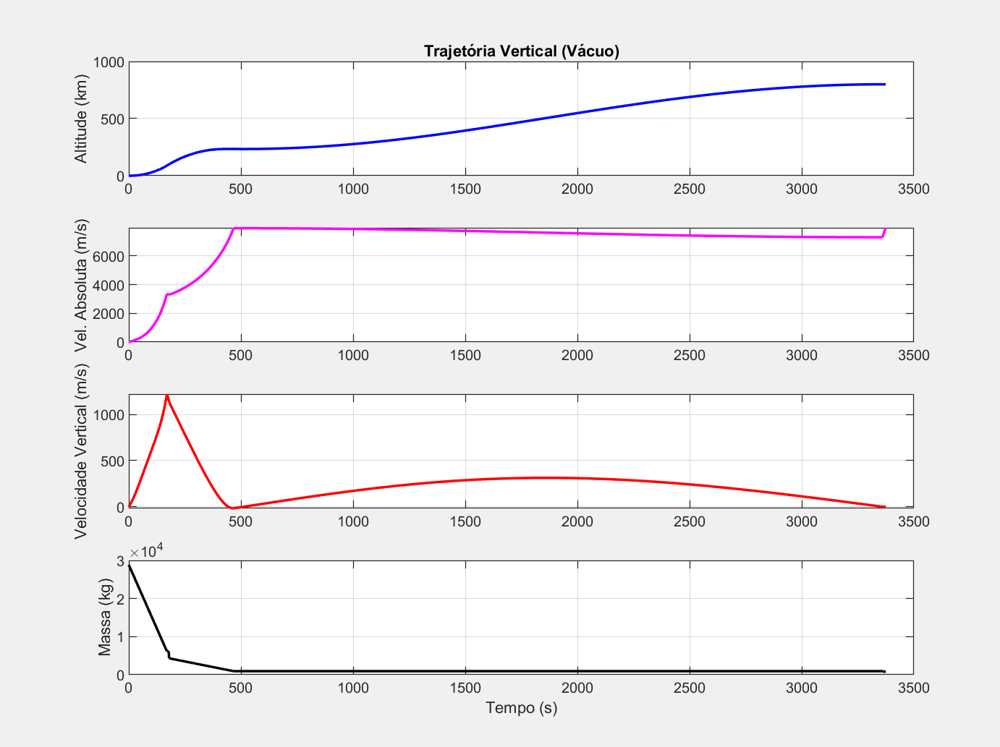
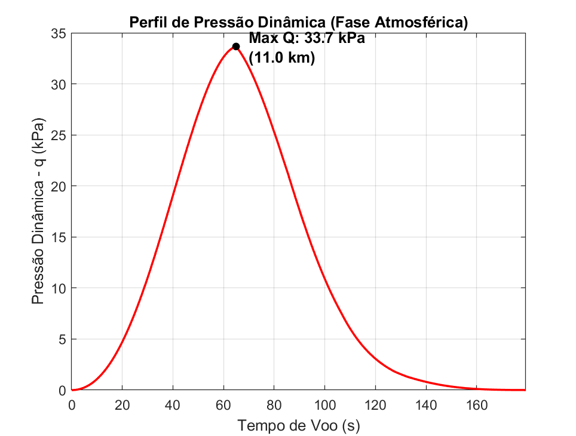
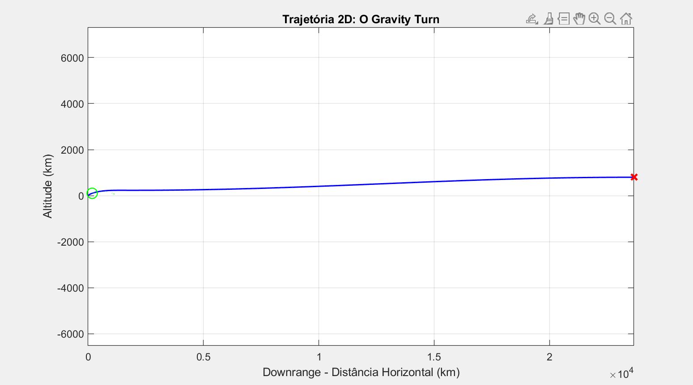
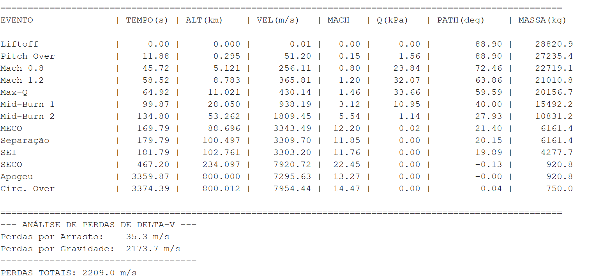
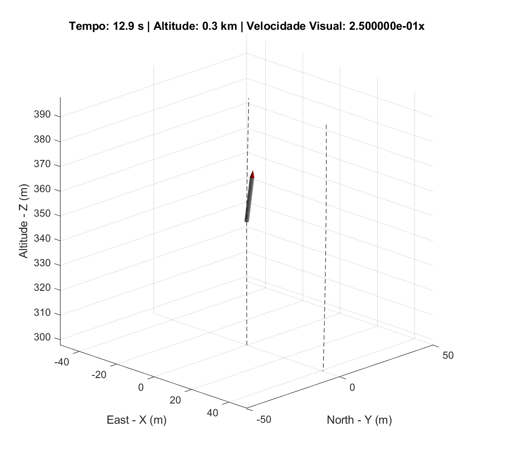

# ARES - Aerospace Rocketry Evaluation Simulator 🚀

> A 6-DOF (Degrees of Freedom) simulator focused on launch trajectory analysis and aerospace vehicle dynamics, fully developed in MATLAB.

## 📌 Overview
ARES was designed to model the equations of motion of a launch vehicle, allowing the validation of trajectories from vertical flights in a vacuum to inclined profiles with standard atmospheric model (ISA) integration. This project serves as a robust testing environment for Guidance, Navigation, and Control (GNC) algorithms.

## ⚙️ Core Architecture & Features
* **Atmospheric Integration:** Implementation of the ISA (International Standard Atmosphere) model for altitudes up to 100 km.
* **6-DOF Dynamics:** Full resolution of the Equations of Motion (EoM) for translation and rotation.
* **Frame Flexibility:** Support for body-fixed reference frames.
* **Mission Event Management:** Detection and transition of flight phases (e.g., burnout, stage separation).

## 🧮 Mathematical Foundations
The simulator relies on the numerical integration of the vehicle's state. The dynamic state vector is propagated over time based on the classical equations of motion.

### Attitude Representation: Quaternions vs. Euler Angles
To represent the vehicle's attitude, ARES employs **quaternions** rather than traditional Euler angles. While Euler angles provide an intuitive understanding of roll, pitch, and yaw, they suffer from a critical mathematical singularity known as **gimbal lock** (which occurs when the pitch angle approaches $\pm 90^\circ$). Given that launch vehicles operate extensively at near-vertical orientations, avoiding this singularity is paramount.

Quaternions ($q_0, q_1, q_2, q_3$) eliminate gimbal lock entirely, ensuring a robust and continuous attitude calculation across all flight phases. Furthermore, quaternion kinematics rely on linear differential equations, which significantly reduces the computational overhead during numerical integration by avoiding expensive trigonometric functions.

## 🚀 How to Run Locally
To run the full simulation on your machine, follow these steps:

1. Clone this repository to your local environment.
2. Ensure MATLAB is installed (R2022a or higher recommended).
3. Open the main script `ARES_V2.m`.
4. Vehicle parameters can be adjusted directly in the associated Excel file (`Veiculos.xlsx`).
5. Run the script. The telemetry results will be automatically generated in your workspace.

## 📊 Results & Demonstration
The plots observed below illustrate exemplary simulation results corresponding to a specific vehicle configuration. These operational parameters can be easily modified or tailored to different mission requirements directly within the `Veiculos.xlsx` spreadsheet. The architecture utilizes the `loadVeiculo_V2(...)` function, which is responsible for dynamically parsing and loading the correct configuration into the simulation environment before execution.

---
**Author:** Leandro Ribeiro Sá
**License:** Distributed under the MIT License. See the `LICENSE` file for more information.
